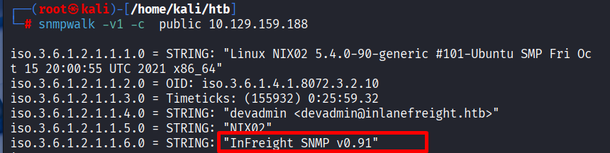

# https://academy.hackthebox.com/module/112/section/1075

### **1) Title**

**Sensitive Information Disclosure via Misconfigured SNMP Service**

### **2) Summary**

The SNMP service on the target server is configured with the default community string "public", allowing unauthorized users to query system information. This misconfiguration exposes sensitive details, including administrator contact information, software versions, and the output of internal custom scripts.

### **3) Steps to Reproduce**

**Step 1:**
Perform a network scan to identify open UDP ports on the target. `nmap -sU -p 161 10.129.159.188`

**Step 2:**
Enumerate the SNMP service using the tool `snmpwalk` (or `braa`) with the community string "public".
Command: `snmpwalk -v1 -c public 10.129.159.188`

**Step 3:**
Analyze the output to locate sensitive strings such as the administrator's email, specific software versions, and extended SNMP objects (NET-SNMP-EXTEND-MIB).

---

### **4) Proof of Concept**

**Command Used:**

`snmpwalk -v 2c -c public 10.129.159.188`

**Screenshots:**

**Screenshot 1:** *Shows the command execution and the retrieval of the Administrator's Email.*

**Screenshot 2:** *Shows the software name and version.*

**Screenshot 3:** *Shows the custom script output revealing the flag.*

**Key Findings (Data Samples):**

- **Admin Email:** `iso.3.6.1.2.1.1.4.0 = STRING: "devadmin <devadmin@inlanefreight.htb>"`
- **System Version:** `iso.3.6.1.2.1.1.6.0 = STRING: "InFreight SNMP v0.91"`
- **den Flag:** `iso.3.6.1.2.1.25.1.7.1... = STRING: "HTB{5nMp_fl4g_uidhfljnsldi----}"`

---

---

### **5) Impact / التأثير**

An attacker can utilize the exposed information to conduct targeted social engineering attacks (Phishing) using the administrator's email or search for specific exploits related to the disclosed software version (`InFreight SNMP v0.91`). Additionally, the exposure of custom script outputs (like the flag) indicates that internal system data is leaking, which could lead to further compromise or sensitive data loss.

---

### **6) Recommendation**

**Short fix:**
Change the default community string "public" to a strong, complex string and restrict network access to the SNMP service.

**Technical details:**

1. **Modify Configuration:** Edit the `/etc/snmp/snmpd.conf` file. Replace `rocommunity public` 
2. **IP Restriction:** Configure the firewall (iptables/UFW) or the SNMP configuration to only accept connections from the management server IP.
    - *Example:* `rocommunity <String> <Management_IP_Only>`
3. **Upgrade Protocol:** Consider upgrading to **SNMPv3**, which supports authentication and encryption, unlike SNMPv2c which sends data in cleartext.
