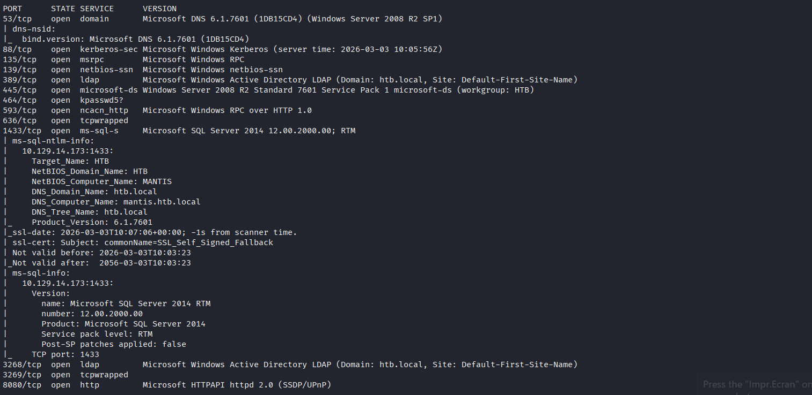

# Mantis HTB Write-Up: From Web Enumeration to GoldenPac (Domain Admin)

## Machine Information

- **Name:** Mantis
- **OS:** Windows
- **Difficulty:** Hard

## Phase 1: Reconnaissance & Information Gathering

As always, we start the enumeration by running a full nmap scan on the target to identify open ports, services, and the operating system.

command:

`nmap -sC -sV -Pn 10.129.14.173`

**Key Findings from Nmap:**

- **Open Ports:** 8080 (HTTP), 1337 (HTTP), 1433 (MSSQL), LDAP, Kerberos, and SMB.
- **Domain Information:** htb.local
- **Computer Name:** mantis.htb.local
- **Operating System:** Windows Server 2008 R2.

Since we found domain names, the first critical step is to map these to our target IP address in the /etc/hosts file.

Although I successfully authenticated to SMB as an anonymous user, the server did not expose any accessible network shares, leaving this vector as a dead end

---

## Phase 2: Web Enumeration & Information Discovery

With the SMB attack vector not providing immediate access to files, I shifted my focus to the web service running on port 8080.
To map out the application and discover any hidden paths or forgotten directories, I launched a directory brute-force attack using Gobuster with a standard directory list.

**Command:**

`gobuster dir -u http://10.129.14.173:8080/ -w /home/kali/files/SecLists-master/Discovery/Web-Content/DirBuster-2007_directory-list-lowercase-2.3-medium.txt -t 20`

Gobuster quickly discovered an interesting directory called /secure_notes/. Navigating to http://10.129.14.173:8080/secure_notes/ in the browser, I found several text files containing internal IT instructions:

This confirmed that a database named orcharddb exists, with a default admin user configured!

---

## 🧩 Phase 3: Cryptography & Decoding

Looking closer at the files hosted in /secure_notes/, one file had a very strange name, which appeared to be encoded.

**Encoded File Name:**

NmQyNDI0NzE2YzVmNTM0MDVmNTA0MDczNzM1NzMwNzI2NDIx

First, I recognized this format as Base64. After decoding it once, it resulted in a Hex string (Base16):

6d2424716c5f53405f504073735730726421

I took this Hex string and decoded it again, which successfully revealed what looked like a highly complex SQL password:

**Decoded Password:** m$$ql_S@_P@ssW0rd!

---

## Phase 4: Database Exploitation (MSSQL)

Armed with the open MSSQL port (1433), the username admin, and the newly cracked password m$$ql_S@_P@ssW0rd!, I fired up msfconsole (Metasploit) to interact directly with the database.

I used the MSSQL query auxiliary scanner to pull data from the server.

`msfconsole > search sql find
msf auxiliary(admin/mssql/mssql_findandsampledata)`

**Options Set in Metasploit:**

- set DATABASE orcharddb
- set USERNAME admin
- set PASSWORD m$$ql_S@_P@ssW0rd!
- set RHOSTS 10.129.14.173
- set SAMPLE_SIZE 7 *(Note: Adjusting this limit helped retrieve the necessary data).*

Running the exploit directly dumped rows from the user table, yielding new domain credentials:

- **User:** james
- **Password:** J@m3s_P@ssW0rd!

---

## 💥 Phase 5: Privilege Escalation (MS14-068 / GoldenPac)

We now have valid credentials for the Active Directory domain user james. We already know the machine is running Windows Server 2008 R2, an older OS that is notoriously vulnerable to **MS14-068** if not properly patched.

To automate this complex attack, we can use Impacket's impacket-goldenPac This tool generates the fake PAC, requests a forged Ticket Granting Ticket (TGT) with high privileges

**Command Executed:**

`impacket-goldenPac HTB.LOCAL/james:'J@m3s_P@ssW0rd!'@mantis.htb.local`

The exploit works flawlessly. We instantly gain an administrative shell on the server as NT AUTHORITY\SYSTEM. Both user and root flags can now be successfully captured.
